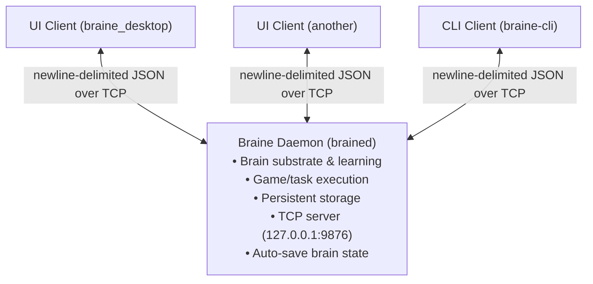

# Braine Service Architecture

## Overview

Braine uses a **client-server architecture** for proper application behavior:

- **`brained`**: Background daemon/service that runs continuously
- **`braine_desktop`**: UI client that connects to the daemon

This allows:
- Brain to run 24/7 in the background
- Multiple UI instances to connect
- Proper data persistence in system directories
- Clean separation of concerns

## Architecture



## Data Storage

Brain state is automatically persisted to:

- **Linux**: `~/.local/share/braine/braine.bbi`
- **Windows**: `%APPDATA%\Braine\braine.bbi`
- **MacOS**: `~/Library/Application Support/Braine/braine.bbi`

## Usage

### Start the Daemon

```bash
# In background
brained &

# Or with logging
brained 2>&1 | tee braine.log &
```

### Start the UI

```bash
braine_desktop
```

The UI will connect to the daemon automatically.

### Protocol

The daemon listens on `127.0.0.1:9876` and uses line-delimited JSON:

**Request:**
```json
{"type": "GetState"}
{"type": "Start"}
{"type": "Stop"}
{"type": "SetMode", "mode": "human"}
{"type": "HumanAction", "action": "left"}
{"type": "TriggerDream"}
{"type": "SaveBrain"}
```

**Response:**
```json
{"type": "State", "running": true, "frame": 12345, ...}
{"type": "Success", "message": "Brain saved"}
{"type": "Error", "message": "File not found"}
```

## System Service (Future)

### Linux (systemd)

Create `~/.config/systemd/user/brained.service`:

```ini
[Unit]
Description=Braine Learning Daemon
After=network.target

[Service]
Type=simple
ExecStart=/usr/local/bin/brained
Restart=always

[Install]
WantedBy=default.target
```

Enable:
```bash
systemctl --user enable brained
systemctl --user start brained
```

### Windows (Service)

Future: Use `sc.exe` or NSSM to install as Windows service

### MacOS (launchd)

Create `~/Library/LaunchAgents/com.braine.daemon.plist`

## Building

```bash
# Build daemon
cargo build --release -p brained

# Build UI client  
cargo build --release -p braine_desktop

# Install both
cargo install --path crates/brained
cargo install --path crates/braine_desktop
```

## Development

```bash
# Terminal 1: Run daemon with logs
cargo run -p brained

# Terminal 2: Run UI
cargo run -p braine_desktop
```
