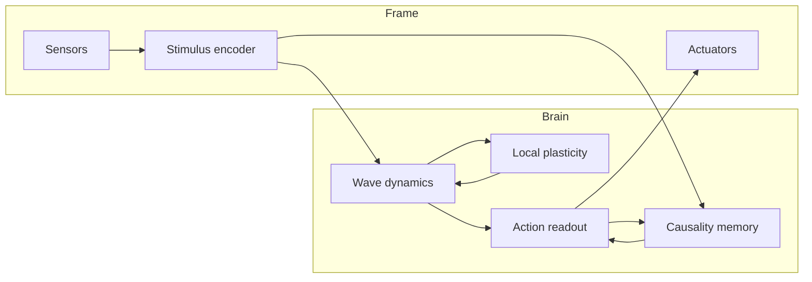
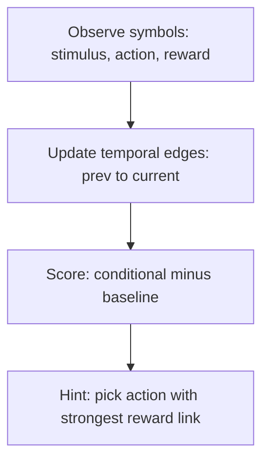
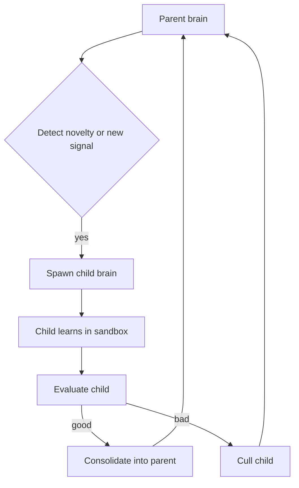
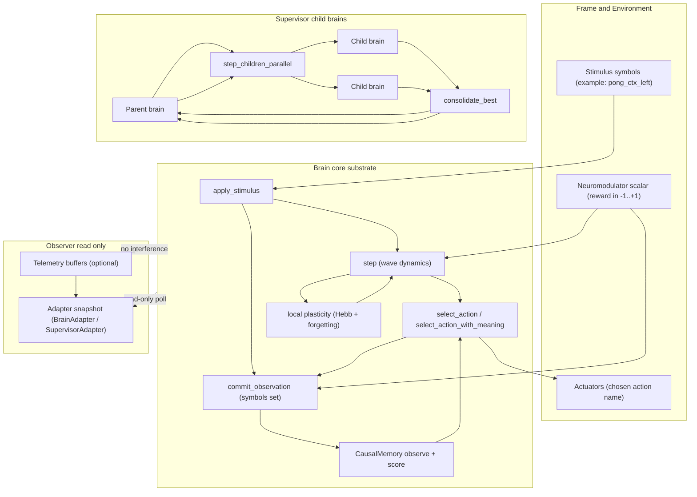

# Architecture

This project is intentionally **not** an LLM. It is a continuously-running dynamical substrate with local learning.

## 1) Cognitive substrate (the “brain”)

### Core state
Each `Unit` holds only scalars:
- amplitude `amp`
- phase `phase`
- bias `bias`
- decay `decay`
- sparse outgoing `connections: Vec<(target, weight)>`

No vectors, no matrices.

### Update rule (continuous-time-ish)
At each tick, each unit updates from:
- local neighbor influence (sparse couplings)
- bias
- external stimulus injection
- global inhibition (competition)
- decay (forgetting at the state level)
- bounded noise (exploration)

This produces:
- stable attractors (habits / identity)
- context-dependent recall (partial stimulus triggers prior patterns)
- deterministic behavior far from thresholds
- random behavior near thresholds

### Learning (local, immediate)
Learning is local and event-based:
- If two units are co-active and phase-aligned, strengthen the coupling.
- Otherwise apply slight anti-Hebb pressure to encourage specialization.
- Neuromodulator scales learning rate (reward/salience).

### Forgetting (structural)
Connections decay continuously. Tiny weights are pruned.
This enforces:
- bounded memory usage
- relevance to recent capabilities
- energy efficiency (fewer active couplings)

## 2) “Body/frame” infrastructure (interface to the world)

A practical edge-deployable agent needs a thin infrastructure layer we’ll call the **Frame**.

### Frame responsibilities
- Sensor drivers: camera, mic, IMU, network packets, system telemetry.
- Preprocessing (minimal): convert raw signals into sparse stimulation patterns.
- Actuator drivers: motor commands, UI events, network outputs.
- Clock/tick management: fixed timestep or event-driven scheduling.
- Power management: duty cycling, sleep modes, wake on stimulus.
- Persistence: snapshot/restore of couplings + a small amount of state.

### Frame ↔ Brain interface
- `Stimulus { name, strength }` excites a named sensor group.
- Brain produces actions by readout from action groups.

We keep the interface symbolic only at the boundary (names). Internally, representations remain distributed and dynamical.

## 4) Causality and meaning (minimal)

"Meaning" here is not language. It is a learned link between:
- what was perceived (stimulus symbol)
- what the system did (action symbol)
- what tended to happen next (reward/other outcomes)

We implement a cheap temporal causal memory: previous events \(A\) → next events \(B\).

## 5) Child brains (spawn, learn, consolidate)

Child brains are short-lived sandboxes:
- Parent keeps identity stable.
- Child explores or learns a new signal.
- Parent consolidates only strong, useful changes.

## 6) Braine internals: data flow (including observers)

This diagram highlights the *runtime loop* and where learning, meaning, and observation happen.

## 3) Why this is “fundamentally different” from LLMs

This system:
- does not tokenize or predict sequences
- does not minimize a dataset-wide loss
- does not require pretraining
- learns online, locally, and immediately

Important caveat: many ingredients (attractors, local plasticity, oscillations) exist in prior research. The novelty claim should be framed as the **specific combination** aimed at edge constraints and “memory=state” design goals, not as inventing oscillators or Hebbian learning.
