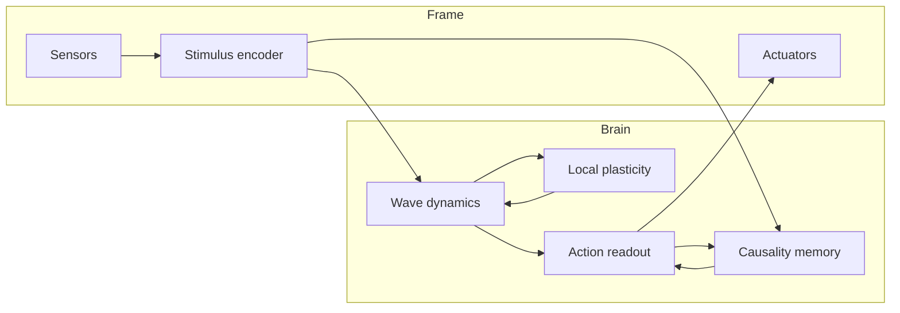
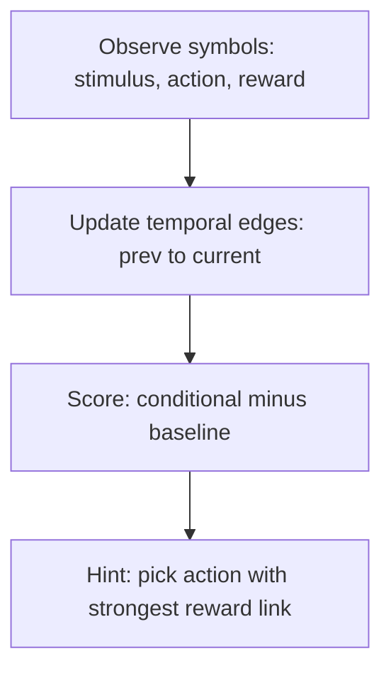
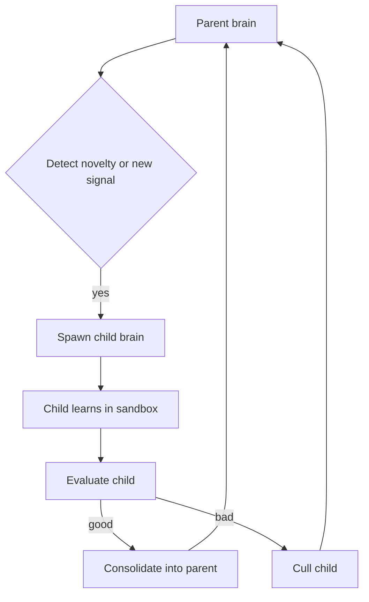
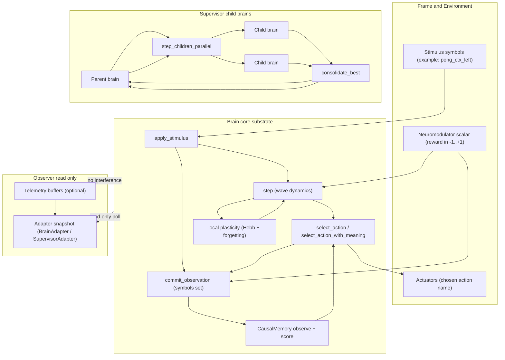

# Architecture

This project is intentionally **not** an LLM. It is a continuously-running dynamical substrate with local learning.



## 1) Cognitive substrate (the “brain”)

### Core state
Each `Unit` holds only scalars:
- amplitude `amp`
- phase `phase`
- bias `bias`
- decay `decay`

Connections are stored in **CSR (Compressed Sparse Row)** format for cache efficiency:
- `offsets: Vec<usize>` — index into targets/weights for each unit
- `targets: Vec<UnitId>` — target unit IDs (INVALID_UNIT for pruned)
- `weights: Vec<f32>` — connection weights

No vectors, no matrices.

### Update rule (continuous-time-ish)
At each tick, each unit updates from:
- local neighbor influence (sparse couplings)
- bias
- external stimulus injection
- global inhibition (competition)
- decay (forgetting at the state level)
- bounded noise (exploration)

This produces:
- stable attractors (habits / identity)
- context-dependent recall (partial stimulus triggers prior patterns)
- deterministic behavior far from thresholds
- random behavior near thresholds

### Learning (local, immediate)
Learning is local and event-based:
- If two units are co-active and phase-aligned, strengthen the coupling.
- Otherwise apply slight anti-Hebb pressure to encourage specialization.
- Neuromodulator scales learning rate (reward/salience).

### Forgetting (structural)
Connections decay continuously. Tiny weights are pruned.
This enforces:
- bounded memory usage
- relevance to recent capabilities
- energy efficiency (fewer active couplings)

## 2) “Body/frame” infrastructure (interface to the world)

A practical edge-deployable agent needs a thin infrastructure layer we’ll call the **Frame**.

### Frame responsibilities
- Sensor drivers: camera, mic, IMU, network packets, system telemetry.
- Preprocessing (minimal): convert raw signals into sparse stimulation patterns.
- Actuator drivers: motor commands, UI events, network outputs.
- Clock/tick management: fixed timestep or event-driven scheduling.
- Power management: duty cycling, sleep modes, wake on stimulus.
- Persistence: snapshot/restore of couplings + a small amount of state.

### Daemon + clients (brained, braine_desktop, braine-cli)
This repo also includes a small “frame” implementation as a background daemon:

- **Daemon**: `brained` owns the single authoritative in-memory brain and runs the online learning loop.
- **Clients**:
	- `braine_desktop` (Slint UI) polls state and sends control requests.
	- `braine-cli` sends one-shot requests (start/stop/status, etc).

They communicate over a simple line-delimited JSON protocol over TCP on `127.0.0.1:9876`.

#### Two separate speed knobs (important)
The daemon intentionally separates:

- **Simulation framerate (FPS)**: how often the daemon ticks/steps.
	- Request: `SetFramerate { fps }`
	- CLI: `braine-cli fps <1-1000>`

- **Task trial period (ms)**: how often the Spot task starts a new trial / flips the stimulus.
	- Request: `SetTrialPeriodMs { ms }`
	- CLI: `braine-cli trialms <10-60000>`

This decoupling prevents “faster compute” from automatically turning into “faster stimulus flicker”, and makes experiments reproducible (task schedule stays constant even if FPS changes).

### Frame ↔ Brain interface
- `Stimulus { name, strength }` excites a named sensor group.
- Brain produces actions by readout from action groups.

We keep the interface symbolic only at the boundary (names). Internally, representations remain distributed and dynamical.

### Stimulus “encoding” and “decoding” (non-transformer)

For signals like `spot_left` / `spot_right`, think of the Frame as providing a **stable symbolic handle** and the substrate as providing a **distributed encoder/decoder**:

- **Encoder (in substrate terms):** a *named sensor group*.
	- When `apply_stimulus(Stimulus { name, strength })` runs, it injects input current into that group’s units.
	- The name is also “interned” as a symbol so causality/meaning can refer to it.

- **One-shot concept formation (imprinting):** if the stimulus is novel/strong enough, the substrate picks a quiet unit and connects sensor↔concept.
	- This creates a sparse “engram” that can later be reactivated by partial stimulation.

- **Decoder (practical view):** reactivation is *implicit*.
	- When the stimulus pattern reappears, the sensor units drive the concept unit, which then feeds back into the recurrent dynamics and can bias action selection.

### “Muscle memory” / savings

The substrate has forgetting and pruning, but we want re-learning to be faster for previously-seen stimuli.
To support this, we keep a weak non-zero trace for **sensor↔concept** links created by imprinting:

- Those links can decay, but they are not pruned to zero.
- Effect: after a stimulus disappears for a long time, the association may weaken, but on re-exposure it can “snap back” faster because the engram still exists.

## 4) Causality and meaning (minimal)

"Meaning" here is not language. It is a learned link between:
- what was perceived (stimulus symbol)
- what the system did (action symbol)
- what tended to happen next (reward/other outcomes)

We implement a cheap temporal causal memory: previous events \(A\) → next events \(B\).

### Bounded context (important for edge autonomy)
To keep long-running deployments stable without manual resets, causal memory is kept **bounded**:
- Symbol and edge counts decay continuously.
- Near-zero entries are periodically pruned.

This prevents unbounded growth of the causal hashmaps while keeping the “recently useful” structure.

### What the UI shows
The daemon (`brained`) reports additional runtime signals to help verify learning and self-maintenance without external supervision:
- `pruned_last_step` — how much structural forgetting happened recently
- `births_last_step` — how much neurogenesis happened recently
- `saturated` — whether the network is in a “needs more capacity” regime (same threshold used by auto-neurogenesis)
- causal stats: base symbol count, edge count, and last-tick update counts (directed + co-occur)



## 5) Child brains (spawn, learn, consolidate)

Child brains are short-lived sandboxes:
- Parent keeps identity stable.
- Child explores or learns a new signal.
- Parent consolidates only strong, useful changes.

This is a high-level overview. The full general mechanism (all games), expected behavior vs current, and the concrete implementation checklist live in:
- [Experts / Child-Brain Mechanism](experts.md)



## 6) Braine internals: data flow (including observers)

This diagram highlights the *runtime loop* and where learning, meaning, and observation happen.



## 3) Why this is “fundamentally different” from LLMs

This system:
- does not tokenize or predict sequences
- does not minimize a dataset-wide loss
- does not require pretraining
- learns online, locally, and immediately

Important caveat: many ingredients (attractors, local plasticity, oscillations) exist in prior research. The novelty claim should be framed as the **specific combination** aimed at edge constraints and “memory=state” design goals, not as inventing oscillators or Hebbian learning.
## 7) Execution tiers (scalability)

The substrate supports multiple execution backends via `ExecutionTier`:

| Tier | Feature Flag | Use Case | Implementation |
|------|-------------|----------|----------------|
| `Scalar` | (default) | MCU, WASM, baseline | Single-threaded, no SIMD |
| `Simd` | `--features simd` | ARM NEON, x86 SSE/AVX | Vectorized amp/phase updates (4-wide f32x4) |
| `Parallel` | `--features parallel` | Desktop/server | Multi-threaded via rayon |
| `Gpu` | `--features gpu` | Large substrates (10k+ units) | wgpu compute shaders |

### Tier selection
```rust
brain.set_execution_tier(ExecutionTier::Parallel);
```

### Performance characteristics
- **Scalar**: ~100μs for 512 units, works everywhere
- **SIMD**: ~30% faster than scalar for dense updates
- **Parallel**: Better for >1024 units with high connectivity
- **GPU**: Amortizes at 10k+ units (CPU-GPU transfer overhead)

The sparse neighbor accumulation (graph traversal) runs on CPU for all tiers. Only the dense amplitude/phase update loop is vectorized or offloaded.

## 8) Benchmarking

Run performance benchmarks with criterion:

```bash
cargo bench                                    # Scalar baseline
cargo bench --features simd                    # With SIMD
cargo bench --features parallel                # With rayon
cargo bench --features "simd,parallel,gpu"     # All features
```

Benchmarks measure:
- `step_sizes/*`: step() at 64/128/256/512 units
- `step_tier/*`: Scalar vs SIMD vs Parallel vs GPU at fixed size
- `learning/*`: Hebbian update performance
- `serialization/*`: Save/load round-trip
- `csr_ops/*`: CSR neighbor iteration