# Accelerated Learning Mechanisms

This document catalogs learning acceleration strategies for braine, ranging from
implemented features to speculative research directions.

## Implementation Status Summary

| # | Mechanism | Status | API |
|---|-----------|--------|-----|
| 1 | Three-Factor Hebbian | ✅ Implemented | `step()` |
| 2 | One-Shot Imprinting | ✅ Implemented | `imprint()` |
| 3 | Neurogenesis | ✅ Implemented | `grow_unit()`, `maybe_neurogenesis()` |
| 4 | Pruning | ✅ Implemented | `forget_and_prune()`, `prune_inactive_units()` |
| 5 | Child Brains | ✅ Implemented | `Supervisor` |
| 6 | STDP | 📋 Proposed | - |
| 7 | Burst-Mode Learning | ✅ Implemented | `apply_burst_learning()` |
| 8 | BCM Homeostasis | 📋 Proposed | - |
| 9 | Dream Replay | ✅ Implemented | `dream()` |
| 10 | Attention Gating | ✅ Implemented | `attention_gate()` |
| 11 | Meta-Learning | 📋 Proposed | - |
| 12 | Predictive Shortcut | 📋 Proposed | - |
| 13 | Forced Sync | ✅ Implemented | `force_associate()` |
| 14 | Idle Dreaming & Sync | ✅ Implemented | `idle_maintenance()`, `idle_dream()`, `global_sync()` |

**Summary**: 10 of 14 mechanisms implemented (71%)

---

## Learning Mechanism Hierarchy

Braine learning operates at multiple levels:


| Level | Mechanism | Timescale | What it encodes |
|-------|-----------|-----------|-----------------|
| **Macro** | Child brains (Supervisor) | Seconds-hours | Entire behavioral strategies |
| **Meso** | Neurogenesis | Steps-minutes | Fresh capacity for new concepts |
| **Micro** | Hebbian + Neuromodulation | Per-step | Connection weights, phase coupling |
| **Nano** | Imprinting | One-shot | Stimulus-concept associations |

---

## Learning Pipeline Overview

```mermaid
flowchart LR
    subgraph Input["📥 Input"]
        S[Stimulus]
        R[Reward]
    end
    
    subgraph What["🎯 WHAT to learn"]
        BU[Burst Detection]
        ST[STDP Timing]
        PS[Predictive Shortcut]
    end
    
    subgraph How["⚡ HOW FAST"]
        NM[Neuromodulator]
        ML[Meta Learning Rate]
        BC[BCM Homeostasis]
    end
    
    subgraph Where["📍 WHERE"]
        AG[Attention Gating]
        PI[Protected Identity]
    end
    
    subgraph Store["💾 STORE"]
        NG[Neurogenesis]
        DR[Dream Replay]
        PR[Pruning]
    end
    
    S --> What
    R --> How
    What --> How
    How --> Where
    Where --> Store
```



---

## Implemented Mechanisms

### 1. Three-Factor Hebbian Learning

**Status**: ✅ Implemented




```mermaid
flowchart TD
    subgraph Factors["Three Factors"]
        F1["1️⃣ Pre-synaptic<br/>unit_A.amp > threshold"]
        F2["2️⃣ Post-synaptic<br/>unit_B.amp > threshold"]
        F3["3️⃣ Neuromodulator<br/>reward signal"]
    end
    
    F1 --> Check{All active?}
    F2 --> Check
    F3 --> Check
    
    Check -->|Yes| Phase{Phase aligned?}
    Check -->|No| Skip[No learning]
    
    Phase -->|Yes| LTP["✅ Strengthen<br/>Δw = +lr × alignment"]
    Phase -->|No| LTD["❌ Weaken<br/>Δw = -lr × 0.05"]
```

**Speedup levers**:
- Increase `hebb_rate` (default 0.08, can go to 0.3+)
- Increase `neuromodulator` (0.0-1.0 scales learning)
- Lower `coactive_threshold` (more units participate)
- Lower `phase_lock_threshold` (easier to strengthen)

---

### 2. One-Shot Imprinting

**Status**: ✅ Implemented


**Speedup**: One exposure creates a retrievable concept (1000× faster than pure Hebbian).

---

## UI Triggers (daemon + visualizer)

The daemon + UI expose a few manual triggers that map directly to core substrate operations:

- **Dream**: calls `dream_replay()` which runs multiple short offline consolidation episodes.
    Useful after a small success streak to stabilize structure.
- **Burst**: calls `set_burst_mode(true, …)` to temporarily boost learning intensity.
    Useful when the task changes and the substrate needs to adapt quickly.
- **Sync**: calls `force_synchronize_sensors()` to phase-align sensor groups.
    Useful after regime shifts/reversals to make encoding more coherent.
- **Imprint**: calls `imprint_current_context()` for one-shot association.
    Useful when the substrate is missing a “concept handle” for the current context.

---

### 3. Neurogenesis

**Status**: ✅ Implemented


**Key insight**: Neurogenesis adds capacity, but new units still learn via normal Hebbian—they need OTHER mechanisms to learn fast.

---

### 4. Structural Forgetting (Pruning)

**Status**: ✅ Implemented

```mermaid
flowchart LR
    subgraph Decay["Weight Decay"]
        W["weight"]
        D["weight × (1 - forget_rate)"]
    end
    
    W --> D
    
    subgraph Check["Threshold Check"]
        D --> C{|w| < prune_below?}
    end
    
    C -->|No| Keep[Keep connection]
    C -->|Yes| Prune
    
    subgraph Prune["Pruning"]
        T[Set target = INVALID]
        Z[Set weight = 0]
    end
    
    T --> Z
    
    subgraph Compact["Periodic Compaction"]
        Z --> R[Rebuild CSR<br/>every 1000 steps]
    end
```


**Effect**: Irrelevant connections disappear, freeing capacity for new learning.

---

### 5. Child Brain Spawning (Supervisor)

**Status**: ✅ Implemented


**Speedup**: Parallel exploration of strategy space (10-1000× vs sequential).

---

## Additional Implemented Mechanisms

### 6. Spike-Timing Dependent Plasticity (STDP)

**Status**: 📋 Proposed



```mermaid
flowchart LR
    subgraph Timeline["Time →"]
        T1["t=0<br/>A fires"]
        T2["t=20ms<br/>B fires"]
        T3["t=50ms<br/>..."]
    end
    
    T1 --> T2
    T2 --> T3
    
    subgraph Rule["STDP Rule"]
        direction TB
        Pre["A fires before B"]
        Post["B fires before A"]
        
        Pre -->|"Δt < 50ms"| LTP["✅ Strengthen A→B<br/>(causal)"]
        Post -->|"Δt < 50ms"| LTD["❌ Weaken A→B<br/>(anti-causal)"]
    end
```

**Why it's faster**: Credit assignment over time windows (10× vs instantaneous Hebbian).

---

### 7. Burst-Mode Learning

**Status**: ✅ Implemented





```mermaid
flowchart TD
    subgraph Detection["Burst Detection"]
        PREV["prev_amp < 0.5"]
        CURR["curr_amp > 1.5"]
        DELTA["Δamp > 1.0 in 1 step"]
    end
    
    PREV --> CHECK{Burst?}
    CURR --> CHECK
    DELTA --> CHECK
    
    CHECK -->|No| Normal["Normal learning<br/>lr = 0.08"]
    CHECK -->|Yes| Burst["🔥 BURST!<br/>lr = 0.8 (10×)"]
    
    subgraph Effect["Effect"]
        Burst --> Flash["Flashbulb memory<br/>One-shot learning"]
    end
```

```mermaid
sequenceDiagram
    participant U as Unit
    participant L as Learning
    
    Note over U: Normal activity
    U->>U: amp = 0.3
    U->>U: amp = 0.4
    U->>U: amp = 0.3
    
    Note over U: 💥 Dramatic event!
    U->>U: amp = 1.8
    U->>L: BURST detected!
    L->>L: lr × 10
    
    Note over L: Strong memory formed
```

**Why it's faster**: Single dramatic events create lasting memories (5-10×).

**API Usage**:
```rust
// Capture state before step
let prev_amps = brain.get_amplitudes();
brain.step();
// Detect and apply burst learning
let bursts = brain.apply_burst_learning(&prev_amps, 0.8, 10.0);
```

---

### 8. Homeostatic Plasticity (BCM Rule)

**Status**: 📋 Proposed



```mermaid
flowchart TD
    subgraph Track["Activity Tracking"]
        AVG["activity_avg = 0.99 × avg + 0.01 × amp"]
        THETA["θ = activity_avg²"]
    end
    
    AVG --> THETA
    
    subgraph Rule["BCM Rule"]
        THETA --> CMP{amp > θ?}
        CMP -->|Yes| LTP["Potentiate<br/>(strengthen)"]
        CMP -->|No| LTD["Depress<br/>(weaken)"]
    end
    
    subgraph Effect["Self-Regulation"]
        LTP --> High["Active units<br/>become selective"]
        LTD --> Low["Quiet units<br/>become sensitive"]
    end
```

**Why it's faster**: Units self-tune, preventing saturation (3-10×).

---

### 9. Dream Replay

**Status**: ✅ Implemented




```mermaid
flowchart TD
    subgraph Disconnect["🌙 Enter Dream Mode"]
        D1[Save pending_input]
        D2[Clear all inputs]
        D3[Boost hebb_rate × 5]
        D4[Set neuromod = 0.8]
    end
    
    D1 --> D2 --> D3 --> D4
    
    subgraph Replay["💭 Replay Loop"]
        R1[Inject random noise]
        R2[step: dynamics + learning]
        R3[Repeat N times]
    end
    
    D4 --> R1
    R1 --> R2
    R2 --> R3
    R3 -->|loop| R1
    
    subgraph Wake["☀️ Wake Up"]
        W1[Restore hebb_rate]
        W2[Restore pending_input]
    end
    
    R3 -->|done| W1 --> W2
```

**Why it's faster**: Compress hours of consolidation into seconds (10-100×).

**API Usage**:
```rust
// Run dream consolidation: 100 steps, 5× learning, 3× noise
let avg_activity = brain.dream(100, 5.0, 3.0);
```

---

### 10. Attention-Gated Learning

**Status**: ✅ Implemented


**Why it's faster**: Focus learning on what matters (2-5×).

**API Usage**:
```rust
// Focus learning on top 10% most active units
brain.attention_gate(0.1);
brain.step();
// Reset gates for next cycle
brain.reset_learning_gates();
```

---

### 11. Meta-Learning

**Status**: 📋 Proposed

```mermaid
flowchart TD
    subgraph Track["Track Utility"]
        ACTIVE{Connection active<br/>during reward?}
        ACTIVE -->|Yes| UP["meta_lr × 1.1"]
        ACTIVE -->|No| DOWN["meta_lr × 0.99"]
    end
    
    subgraph Apply["Apply Meta-LR"]
        UP --> FAST["This connection<br/>learns faster"]
        DOWN --> SLOW["This connection<br/>learns slower"]
    end
    
    subgraph Result["Over Time"]
        FAST --> IMP["Important connections:<br/>high meta_lr"]
        SLOW --> UNIMP["Unimportant connections:<br/>low meta_lr"]
    end
```

```mermaid
graph LR
    subgraph Initial["Initial State"]
        A1((A)) -->|"w=0.3<br/>lr=1.0"| B1((B))
        A1 -->|"w=0.3<br/>lr=1.0"| C1((C))
    end
    
    subgraph AfterReward["After Rewards"]
        A2((A)) -->|"w=0.8<br/>lr=2.1"| B2((B))
        A2 -->|"w=0.1<br/>lr=0.3"| C2((C))
    end
    
    Initial -->|"A→B contributed<br/>A→C didn't"| AfterReward
```

**Why it's faster**: Important connections learn faster automatically.

---

### 12. Predictive Shortcut

**Status**: 📋 Proposed

```mermaid
flowchart TD
    subgraph Causal["Causal Memory"]
        CM[/"Track: stimulus → action → reward"/]
        S2A["P(action | stimulus)"]
        A2R["P(reward | action)"]
    end
    
    CM --> S2A
    CM --> A2R
    
    subgraph Check["Check Causality"]
        S2A --> C1{> 0.5?}
        A2R --> C2{> 0.5?}
        C1 --> AND{Both high?}
        C2 --> AND
    end
    
    AND -->|No| Hebb["Slow Hebbian path"]
    AND -->|Yes| Direct["⚡ Direct wiring!"]
    
    subgraph Shortcut["Direct Connection"]
        Direct --> Wire["stimulus_units → action_units<br/>weight = 0.8"]
    end
```

```mermaid
sequenceDiagram
    participant S as Stimulus
    participant CM as Causal Memory
    participant A as Action
    participant R as Reward
    participant B as Brain
    
    Note over CM: After many episodes...
    CM->>CM: P(brake | red_light) = 0.7
    CM->>CM: P(reward | brake) = 0.8
    
    Note over B: Predictive Shortcut!
    B->>B: causal_strength(red_light, brake) > 0.5 ✓
    B->>B: causal_strength(brake, reward) > 0.5 ✓
    
    B->>B: Directly wire red_light → brake
    Note over B: Skip 1000s of Hebbian steps!
```

**Why it's faster**: Exploit symbolic causality (100×).

---

### 13. Forced Synchronization

**Status**: ✅ Implemented

```mermaid
flowchart TD
    subgraph Setup["Teacher Provides"]
        GRP_A["Group A (stimulus)"]
        GRP_B["Group B (response)"]
    end
    
    subgraph Force["Force Synchronization"]
        GRP_A --> PHASE["Set all phases = 0"]
        GRP_B --> PHASE
        PHASE --> AMP["Set all amps = 1.5"]
        AMP --> NM["Set neuromod = 1.0"]
    end
    
    subgraph Learn["One Step"]
        NM --> STEP["step()"]
        STEP --> ALIGNED["All units phase-aligned<br/>+ highly active<br/>+ max neuromod"]
    end
    
    subgraph Result["Result"]
        ALIGNED --> STRONG["Strong bidirectional<br/>connections formed"]
    end
```

```mermaid
graph LR
    subgraph Before["Before Forced Sync"]
        S1[Sensor 1<br/>φ=0.3]
        S2[Sensor 2<br/>φ=1.2]
        A1[Action 1<br/>φ=-0.8]
        A2[Action 2<br/>φ=2.1]
    end
    
    subgraph During["During Forced Sync"]
        S1f[Sensor 1<br/>φ=0, amp=1.5]
        S2f[Sensor 2<br/>φ=0, amp=1.5]
        A1f[Action 1<br/>φ=0, amp=1.5]
        A2f[Action 2<br/>φ=0, amp=1.5]
        
        S1f <-->|"instant strong"| A1f
        S1f <-->|"instant strong"| A2f
        S2f <-->|"instant strong"| A1f
        S2f <-->|"instant strong"| A2f
    end
    
    Before -->|"force_associate()"| During
```

**Why it's faster**: One-shot by construction (1000×).

**API Usage**:
```rust
// By unit IDs
brain.force_associate(&sensor_ids, &action_ids, 0.6);

// By group names (convenience method)
brain.force_associate_groups("cue", "response", 0.5);
```

---

## Mechanism Synergy Matrix

```mermaid
flowchart TD
    subgraph Capacity["🏗️ Capacity"]
        NG[Neurogenesis]
    end
    
    subgraph Speed["⚡ Speed"]
        BU[Burst Mode]
        ML[Meta-Learning]
        BC[BCM]
    end
    
    subgraph Focus["🎯 Focus"]
        AG[Attention Gating]
        STDP[STDP]
    end
    
    subgraph Store["💾 Storage"]
        DR[Dream Replay]
        PR[Pruning]
    end
    
    NG -->|"new units learn slow<br/>without speed boost"| Speed
    Speed -->|"fast learning is<br/>unfocused without"| Focus
    Focus -->|"focused learning<br/>needs consolidation"| Store
    Store -->|"storage fills up<br/>needs more"| NG
```

| Mechanism | Adds to Neurogenesis by... |
|-----------|---------------------------|
| **Burst mode** | New units learn important events 10× faster |
| **Attention** | Focus learning on new units, not old stable ones |
| **BCM** | Prevent new units from being over/under-active |
| **Dream replay** | Consolidate new units into existing structure |
| **Predictive shortcut** | Wire new units directly to known-good patterns |
| **Forced sync** | One-shot program new units (teacher mode) |
| **Meta-LR** | Give new units higher learning rate initially |

---

## Speed Hierarchy (Theoretical)

| Mechanism | Speedup vs Baseline | Notes |
|-----------|---------------------|-------|
| Baseline Hebbian | 1× | Reference |
| Attention gating | 2-5× | Less noise, focused learning |
| BCM homeostasis | 3-10× | Self-tuning thresholds |
| Burst-mode | 5-10× | Dramatic events stick |
| STDP + traces | 10× | Temporal credit assignment |
| Dream replay | 10-100× | Offline consolidation |
| Predictive shortcut | 100× | Symbolic-level reasoning |
| Evolutionary (child brains) | 10-1000× | Parallel strategy search |
| Forced synchronization | 1000× | One-shot by construction |
| Neurogenesis | ∞ capacity | (Not speedup, but capacity) |

---

## Combination Strategies

### Fast Autonomous Agent

```mermaid
flowchart TD
    subgraph Every["Every Step"]
        S[step: Hebbian learning]
    end
    
    subgraph Periodic100["Every 100 Steps"]
        AG[Attention gating:<br/>focus on top 5%]
    end
    
    subgraph Periodic1000["Every 1000 Steps"]
        NG[Neurogenesis check:<br/>grow if saturated]
    end
    
    subgraph Periodic10000["Every 10000 Steps"]
        DR[Dream replay:<br/>consolidate memories]
    end
    
    S --> Periodic100
    Periodic100 --> Periodic1000
    Periodic1000 --> Periodic10000
    Periodic10000 --> S
```

### Fast Supervised Learning

```mermaid
flowchart LR
    T[Teacher] -->|"(stimulus, correct_action)"| Brain
    Brain -->|"force_associate()"| Learn[Instant learning]
    Learn --> Done[One example = one skill]
```

### Fast Exploration (Evolutionary)

```mermaid
flowchart TD
    P[Parent Brain] --> S1[Child 1]
    P --> S2[Child 2]
    P --> S3[Child 3]
    P --> S4[Child 4]
    
    S1 -->|explore| E1[Score: 0.3]
    S2 -->|explore| E2[Score: 0.8]
    S3 -->|explore| E3[Score: 0.5]
    S4 -->|explore| E4[Score: 0.2]
    
    E2 -->|best| P2[Parent absorbs winner]
```

---

## Research Questions

1. **Scaling**: Does neurogenesis work at 10k+ units? How do new units integrate with existing stable attractors?

2. **Catastrophic forgetting**: Does adding new units destabilize old memories?

3. **Optimal growth rate**: How many units to add, and when? Is there a "critical period" for new units?

4. **Pruning strategy**: When to prune inactive units? Risk of removing latent useful capacity?

5. **Combination effects**: Do multiple acceleration mechanisms interfere or synergize?

---

## Implementation Priority

```mermaid
quadrantChart
    title Implementation Priority
    x-axis Low Effort --> High Effort
    y-axis Low Impact --> High Impact
    quadrant-1 Do First
    quadrant-2 Plan Carefully
    quadrant-3 Maybe Later
    quadrant-4 Quick Wins
    
    Attention Gating: [0.2, 0.6]
    Burst Mode: [0.25, 0.55]
    Dream Replay: [0.35, 0.75]
    BCM: [0.3, 0.5]
    Forced Sync: [0.2, 0.7]
    Predictive: [0.55, 0.85]
    Meta-LR: [0.8, 0.8]
    STDP: [0.65, 0.65]
```

| Mechanism | Impact | Effort | Priority |
|-----------|--------|--------|----------|
| Neurogenesis | High | Done ✅ | - |
| Attention gating | Medium | Done ✅ | - |
| Dream replay | High | Done ✅ | - |
| Burst-mode | Medium | Done ✅ | - |
| Forced sync | High | Done ✅ | - |
| BCM homeostasis | Medium | Low | 🔥 Next |
| Predictive shortcut | Very High | Medium | Soon |
| STDP | High | Medium | Medium-term |
| Meta-learning | Very High | High | Long-term |
