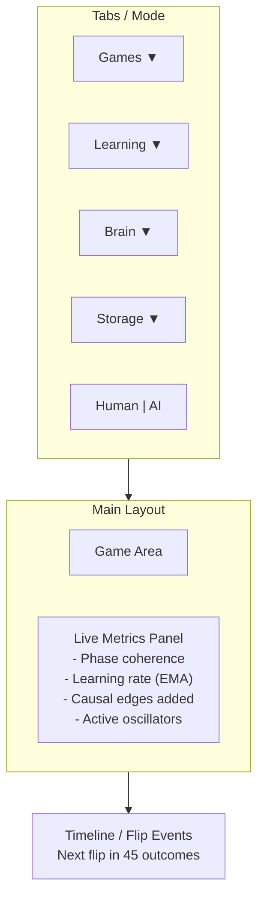

# Braine Enhancement Proposal: Brain Image + Visualizer Redesign

This document proposes enhancements to the brain image format and visualizer that:
1. **Maintain research novelty** (phase-coupled oscillator networks, Hebbian/causal learning)
2. **Enable testing of accelerated learning mechanisms**
3. **Improve UI functionality** for research experimentation

---

## Part 1: Brain Image Format Enhancements

### Current State
The BBI (Braine Brain Image) format v1 is:
- Chunked, versioned, forward-compatible
- Capacity-aware via `CapacityWriter`
- Stores: CFG0, PRNG, STAT, UNIT, MASK, GRPS, SYMB, CAUS

### Proposed Enhancements (v2)

#### 1.1 Activity-Weighted Compression (Novel)
**Concept**: Compress connection data based on **phase coherence** rather than conventional importance.

Instead of storing all connections equally:
- **High-coherence pairs** (frequently synchronized oscillators): store precisely
- **Low-coherence pairs**: store quantized (fewer bits) or defer to sparse diff

This is novel because it uses the oscillator dynamics themselves as a compression signal.

**Implementation**: New `UCMP` chunk (Unit Compressed) with:
```
[precision_bits: u8]  // 4-16 bits for weight quantization
[coherence_threshold: f32]
[full_precision_count: u32]
[full_precision_entries: ...]  // High-coherence connections
[quantized_entries: ...]       // Low-coherence connections
```

#### 1.2 Incremental State Snapshots (Diff-Based)
**Concept**: Store only **delta changes** since last checkpoint for faster autosave.

New chunk type `DIFF`:
- Base checkpoint reference (hash of prior full image)
- Changed units (indices + new values)
- Changed connections (row, col, delta_weight)
- New causal edges

**Benefit**: Autosave becomes O(changed) instead of O(all), enabling higher-frequency snapshots without disk I/O overhead.

#### 1.3 Causal Memory Streaming
**Concept**: Support append-only causal edge logging for post-hoc analysis.

New optional chunk `CLOG` (Causal Log):
- Sequence of (timestamp, src_symbol, dst_symbol, delta) tuples
- Can be replayed to reconstruct causal graph evolution

**Benefit**: Enables research into "when did the brain learn X?" questions.

#### 1.4 Learning Mechanism State Chunks
For the new accelerated learning mechanisms, add state chunks:

| Chunk | Purpose |
|-------|---------|
| `ATNC` | Attention Gating channel states |
| `DRPL` | Dream Replay episode buffer |
| `BRST` | Burst-Mode eligibility traces |
| `SYNC` | Forced Sync cohort memberships |

**Benefit**: Persist learning mechanism state across save/load cycles.

#### 1.5 Metadata + Provenance Chunk
New `META` chunk for research reproducibility:
```
[save_timestamp: u64]
[git_hash: string]
[experiment_name: string]
[total_steps_ever: u64]
[tags: list<string>]
```

---

## Part 2: Visualizer UI Redesign

### Current State
- 6 games: Pong, Bandit, Forage, Whack, Beacon, Sequence
- Top panel: game selection, mode selection, difficulty controls
- HUD: text-based telemetry (wrapped lines)
- Controls: keyboard only (S=save, L=load, arrows=movement)

### Proposed Redesign

#### 2.1 Tabbed Dashboard Layout
Replace single-row button bar with **tabbed panel system**:



#### 2.2 Learning Tab Controls
Expose accelerated learning mechanisms with interactive controls:

| Control | Function |
|---------|----------|
| **Attention Boost** | Slider (0.0 - 1.0) - Temporarily boost attention threshold |
| **Dream Replay** | Button: "Replay Now" - Trigger manual dream replay |
| **Burst Mode** | Toggle + Duration slider - Enable/disable burst learning |
| **Force Sync** | Button: "Sync Sensors" - Force sensor group synchronization |
| **Imprint** | Button: "Imprint Current" - One-shot strong learning |

#### 2.3 Brain Inspection Tab
Real-time visualization of internal state:

- **Oscillator Phase Wheel**: Circular viz showing phase distribution
- **Connection Heatmap**: Small matrix showing weight distribution
- **Symbol Activity**: Bar chart of currently active symbols
- **Causal Graph Mini-View**: Top 10 causal edges as directed graph

#### 2.4 Storage Tab
Enhanced persistence controls:

| Control | Function |
|---------|----------|
| **Quick Save** | Button (was key S) |
| **Quick Load** | Button (was key L) |
| **Checkpoint Name** | Text field for named saves |
| **Autosave Interval** | Dropdown: Off / 30s / 60s / 5m |
| **Image Size** | Display current brain size in bytes |
| **Export Metrics** | Button: dump metrics log to timestamped file |

#### 2.5 Metrics Timeline Panel
Visual timeline showing:
- Reward events (green/red ticks)
- Flip markers (vertical orange lines)
- Recovery points (vertical green lines)
- Score trend (line graph)

---

## Part 3: Game Enhancements for Testing Accelerated Learning

### 3.1 New Test Modes

#### Attention Stress Test Mode
Add toggle to each game: **"Distractor Storm"**
- Spawns extra distractor stimuli
- Tests whether attention gating properly filters noise
- Metric: performance drop when distractors enabled

#### Dream Replay Benchmark Mode
Add toggle: **"Sparse Reward"**
- Reduces reward frequency (1 in N outcomes)
- Tests whether dream replay helps consolidate rare successes
- Metric: learning speed with sparse vs normal rewards

#### Burst Learning Challenge
Add toggle: **"Sudden Flip"**
- Manual button to flip regime immediately
- Measures burst-mode adaptation speed
- Metric: frames to 50% recovery

### 3.2 Enhanced Game: Adaptive Sequence
Upgrade Sequence game to test memory and prediction:

- **Current**: Fixed patterns (ABAC, ACBC)
- **Enhanced**: 
  - Variable-length patterns (3-8 tokens)
  - Noise tokens (X, Y) that should be ignored
  - "Memory depth" test: how many steps back can brain predict?

### 3.3 Enhanced Game: Multi-Beacon
Upgrade Beacon game for attention testing:

- **Current**: 2 beacons (blue/yellow), one target
- **Enhanced**:
  - 4-6 beacons with colors
  - Target indicated by border color OR HUD cue
  - Distractors flash/move to test selective attention

### 3.4 New Game: Delayed Association
Test causal memory + temporal credit assignment:

**Concept**: 
1. Show cue (color/shape) 
2. Delay (5-20 frames)
3. Choose action
4. Reward if action matches cue from step 1

**Metric**: Maximum delay brain can handle accurately

---

## Part 4: Implementation Priority

### Phase 1: UI Redesign (Immediate)
1. Refactor button layout to tabbed system
2. Add Learning tab with mechanism controls
3. Add visual metrics panel (oscillator viz, reward timeline)

### Phase 2: Game Enhancements
1. Add test mode toggles to existing games
2. Implement Multi-Beacon variant
3. Implement Delayed Association game

### Phase 3: Brain Image v2
1. Add META chunk (low risk, high value)
2. Add learning mechanism state chunks
3. Implement incremental diff saves (optional optimization)
4. Activity-weighted compression (research feature)

---

## Novelty Preservation Notes

All proposed enhancements maintain the core novel aspects:
- **Phase-coupled oscillators** remain the computational substrate
- **Hebbian + neuromodulated learning** unchanged
- **Causal memory** enhanced but not replaced
- **No conventional neural network layers** introduced

The enhancements specifically test whether the oscillator approach can:
1. Handle attention (selective synchronization)
2. Benefit from replay (phase pattern reactivation)
3. Adapt rapidly (burst-mode Hebbian spikes)
4. Transfer learning (child brain consolidation)

---

## Summary Table

| Enhancement | Type | Effort | Impact |
|-------------|------|--------|--------|
| Tabbed UI Layout | UI | Medium | High |
| Learning Tab Controls | UI | Medium | High |
| Metrics Timeline | UI | Low | Medium |
| Test Mode Toggles | Game | Low | High |
| Multi-Beacon Game | Game | Medium | High |
| Delayed Association Game | Game | High | High |
| META chunk | Storage | Low | Medium |
| Learning state chunks | Storage | Medium | High |
| Incremental saves | Storage | High | Medium |
| Activity-weighted compression | Storage | High | Low (research) |

