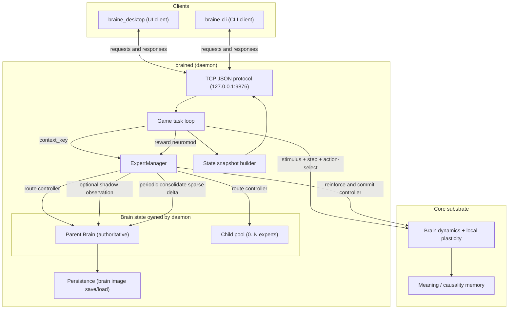
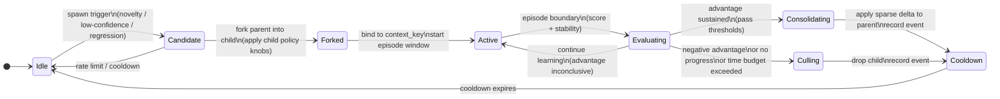
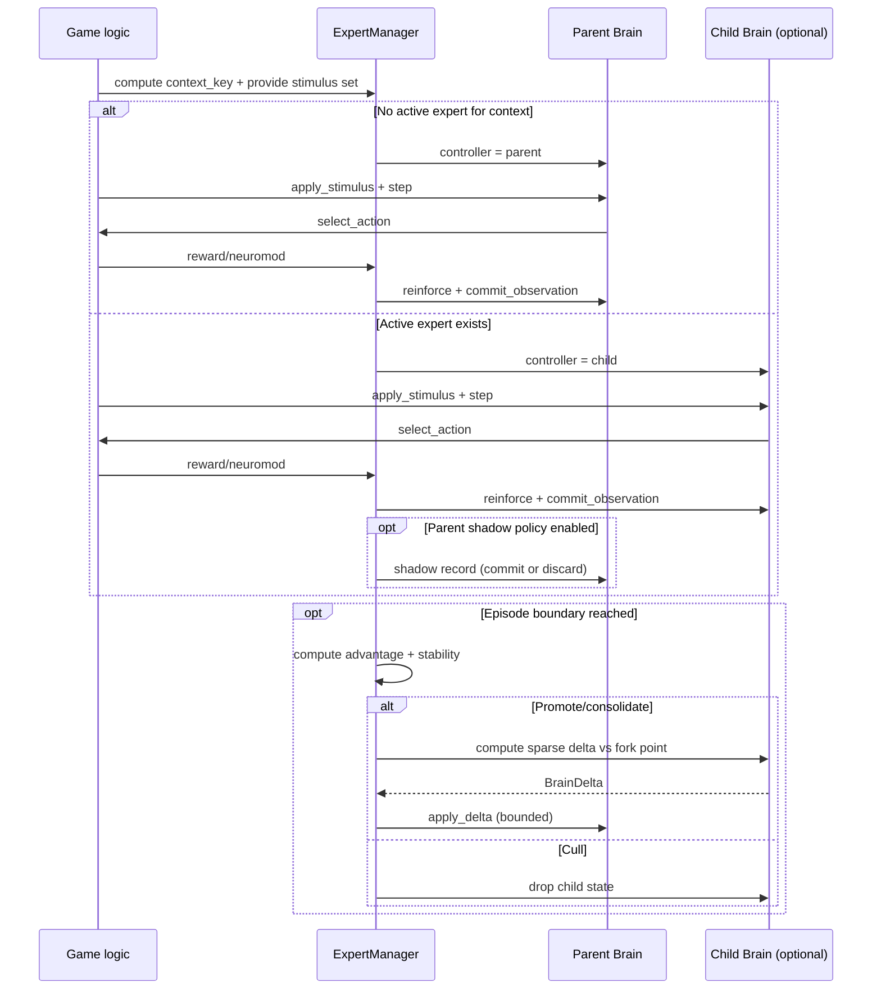

# Expert / Child-Brain Mechanism (General, All Games)

This document specifies a **general** mechanism for spawning and managing short-lived “child brains” (aka **experts**) across **all games**, implemented inside the daemon and core substrate. The goal is to enable fast, localized learning and exploration without destabilizing the long-lived parent brain.

It is written as a **design contract**: expected behavior, invariants, and the concrete code/protocol changes we will make **before** implementing anything.

## 1) Motivation

Current behavior is a single monolithic brain:
- All learning writes go into one shared substrate.
- Exploration and novelty can perturb stable skills (catastrophic interference).
- “Try something new” and “stay competent” are competing demands inside one set of weights.

We want a mechanism that provides:
- **Containment**: exploration/novelty doesn’t immediately overwrite stable competence.
- **Fast adaptation**: a child can run higher plasticity, higher noise, or different gating.
- **Selective consolidation**: only beneficial, stable changes merge back.
- **General applicability**: games differ, but the lifecycle and interfaces should be uniform.

## 2) Definitions

- **Parent brain**: the long-lived `Brain` instance that persists and represents “identity.”
- **Child brain / expert**: a short-lived fork of the parent used as a sandbox.
- **Expert manager**: runtime component responsible for spawn, routing, evaluation, consolidation, and culling.
- **Routing**: deciding whether the parent or a child selects the action for a given step/trial.
- **Episode**: a bounded window used to score an expert (e.g., N trials or T seconds).
- **Context key**: a string (or small tuple) derived from game state indicating “what situation are we in?”

Important constraint: this project is not an LLM and does not use backprop. All learning remains **local plasticity + scalar neuromodulator**.

## 3) High-level contract (invariants)

1. **Parent stability by default**
   - With experts disabled, behavior must remain unchanged.
   - With experts enabled, the parent’s learning can be reduced or paused during expert-led steps (policy choice), but the parent’s action selection remains available.

2. **Children are sandboxed**
   - A child’s plasticity/noise knobs may differ.
   - A child’s structural changes must not affect the parent unless explicitly consolidated.

3. **Consolidation is selective and bounded**
   - Consolidation merges only a bounded set of changes (e.g., top-K weight deltas by magnitude, symbol additions relevant to context, etc.).
   - Consolidation must be deterministic given a fixed random seed and same episode trace.

4. **No protocol changes required for games**
   - Games should not need bespoke “expert logic.”
   - Games provide a context key (or we derive a default), and otherwise run their normal stimulus/action/reward loop.

## 4) Behavioral model (what changes vs current)

### 4.1 Current (baseline)

Per step/trial (simplified):
1. Game applies stimuli.
2. Brain steps dynamics.
3. Brain selects action.
4. Game computes reward.
5. Brain is reinforced and commits observation.

Outcome: all learning writes happen in the single brain.

### 4.2 Proposed (experts enabled)

Per step/trial (simplified):
1. Game computes a **context key** (e.g., `"spotxy::grid_5"`, `"forage::phase_seek"`, `"bandit::arm_set_A"`).
2. Expert manager chooses **controller**:
   - parent only, or
   - an active child bound to that context.
3. Controller brain runs the same cycle: stimulus → step → select action.
4. Reward is assigned to the controller’s observation; parent may also record a “shadow” observation (optional, see policy knobs).
5. Expert manager updates episode scores and decides: keep learning, consolidate, or cull.

Net effect:
- New situations can be explored by children without immediately rewriting the parent.
- Once an expert demonstrates consistent advantage, consolidation makes the parent better.

### 4.3 Intended framing: localized subproblems under a larger task

Yes: the intended use is that child brains are most valuable for **localized subproblems** that arise while the parent is solving a larger, ongoing problem.

In practice, “the parent breaks a bigger problem into smaller ones” is represented by the **context key**:
- The **big problem** is the overall, long-lived game/task loop the daemon is running.
- The **subproblems** are the recurring, bounded situations that are meaningfully different for policy/credit assignment.

Examples:
- Pong: separate subproblems by ball bucket + regime (mapping flip).
- Forage: separate subproblems by goal quadrant + poison proximity regime.
- Sequence: separate by pattern family / phase of the sequence.

Experts are then “small local solvers” bound to those contexts. Consolidation is what turns repeated localized competence into stable parent capability.

### 4.4 Architecture + data flow diagrams

These diagrams describe how state is owned and how information moves between the daemon, parent brain, and child brains.

#### 4.4.1 Overall state management (daemon + experts)

#### 4.4.2 Child state management (expert lifecycle)

#### 4.4.3 Inner workings (per-trial routing, learning, and consolidation)

## 5) Routing and scoring

### 5.1 Default routing policy

We start with the simplest general policy:
- If there is an **active expert** for the current context, use it.
- Otherwise, route to parent.
- Spawn is controlled by explicit novelty/shift/saturation/collapse signals (below).

### 5.2 Spawn triggers (general)

We need triggers that don’t require bespoke game logic and that match the
project’s constraint: **child brains exist only for novelty or distributional shift**.

Spawn only on explicit signals such as:
- **Novel stimulus symbol / modality**: first time a `context_key` appears.
- **Reward regime shift**: recent reward statistics diverge from long-term baseline.
- **Performance collapse**: reward drops sharply relative to historical best baseline.
- **Saturation / attractor brittleness**: parent reports saturation (e.g., growth-needed proxy).

Spawn must be rate-limited:
- Max concurrent children (global).
- Cooldown per context key.

### 5.3 Scoring an expert

Experts are evaluated on a rolling window:
- `reward_ema`: exponential moving average reward while expert controls.
- `advantage`: `reward_ema(expert) - reward_ema(parent_shadow)` if shadowing is enabled; otherwise compare to historical parent baseline for the context.
- `stability`: variance of reward or action entropy (we prefer consistent improvements).

Promotion criteria (initial):
- Advantage above threshold for M episodes.
- No severe instability indicators.

Cull criteria (initial):
- Negative advantage for M episodes.
- No learning progress (advantage slope ~0).
- Hard time budget exceeded.

## 6) Consolidation (merge semantics)

This is the core “what is actually merged?” question.

### 6.1 Minimal merge strategy (initial)

Consolidation merges a **sparse delta** from child → parent:
- Weight deltas: collect all changed connections and select top-K by `|Δw|` (or by estimated contribution to reward if available).
- Optional: add any new group/symbol bindings created by the child that are required to interpret those edges.

Merge rule options (pick one in implementation phase):
- **Direct add**: `w_parent += clamp(Δw, -δmax, +δmax)`
- **Blended**: `w_parent = lerp(w_parent, w_child, α)` for selected edges only

Constraints:
- Never exceed parent capacity limits.
- Never create unbounded growth in symbol tables.

### 6.2 What does NOT merge (initial)

To keep behavior predictable at first, we do not merge:
- Full oscillator state (amp/phase snapshot)
- Full connectivity
- Child-only metrics/history

We only merge structural learning artifacts that correspond to stable associations.

## 7) Policies (configurable knobs)

These are runtime-configurable, but should have safe defaults.

- **Enable experts**: off by default.
- **Parent learning during expert control**:
  - `normal` (parent learns as usual)
  - `reduced` (lower neuromod scaling)
  - `holdout` (parent discards observation)
- **Max children**: small integer.
- **Child plasticity multiplier**: >1 for faster learning.
- **Child exploration/noise multiplier**: optional.
- **Episode length**: trials or time.
- **Consolidation top-K**: bounds work.

## 8) Game integration (general contract)

To make this mechanism work for all games, the only game-facing requirement is:

### 8.1 Context key

Each game must be able to produce a stable context key string for the current situation.

Rules:
- Must be deterministic.
- Should be low-cardinality (avoid embedding raw coordinates continuously unless bucketed).
- Should capture regime changes that matter for policy.

Defaults:
- If a game does not provide a specialized key, use `"<game_name>"`.
- Games can refine over time.

### 8.2 No other game code required

Games still:
- Apply stimuli
- Read chosen action
- Compute reward

Expert routing is entirely inside the daemon loop.

## 9) Protocol + UI expectations (before any implementation)

We should keep existing clients working.

### 9.1 Daemon snapshot additions

Add new fields (all `#[serde(default)]`) to the periodic state snapshot:
- `experts_enabled: bool`
- `experts: { active_count, max_children, last_spawn_reason?, last_consolidation? }`
- `active_expert: Option<{ id, context_key, age_steps, score_summary }>`

### 9.2 Daemon requests (minimal set)

Add requests:
- `SetExpertsEnabled { enabled: bool }`
- `SetExpertPolicy { parent_learning: "normal"|"reduced"|"holdout", max_children: u32, child_plasticity: f32, ... }`
- `CullExperts` (manual reset)

No game-specific requests.

### 9.3 UI behavior (minimal)

UI can remain unchanged initially. If we add UI support, it should:
- Display active expert count and currently controlling brain.
- Provide a simple enable toggle and policy knobs.

## 10) Concrete code changes we expect (what will change)

This section is the checklist of modifications we will make when we start coding.

### 10.1 Core substrate

Files:
- crates/core/src/core/substrate.rs
- crates/core/src/core/supervisor.rs

Expected new capabilities:
- `Brain::fork_for_expert(...) -> Brain` (or `BrainImage`-backed fork)
- A way to compute/apply a bounded sparse diff:
  - `Brain::diff_since_fork(...) -> BrainDelta`
  - `Brain::apply_delta(...)`

### 10.2 Daemon runtime

Files:
 - crates/brained/src/main.rs
 - crates/brained/src/game.rs

Expected additions:
- An `ExpertManager` owned by the daemon alongside the authoritative parent brain.
- Routing hook in the main game loop:
  - choose controller brain
  - run step/action
  - apply reward + observation to the controller
  - optionally shadow parent observation
  - periodically evaluate/cull/consolidate

### 10.3 Games

Files:
 - crates/brained/src/game.rs
 - crates/braine_desktop/ui/*

Expected change:
- Each game provides a context key (can start coarse).
- No per-game expert logic.

### 10.4 Protocol clients

Files:
 - crates/braine_desktop/src/main.rs
 - crates/core/src/bin/braine_cli.rs

Expected change:
- Parse new snapshot fields safely via serde defaults.
- Optionally expose CLI toggles for enable/policy.

## 11) Expected observable differences (testable)

Compared to current behavior, with experts enabled we expect:
- **Lower interference**: previously learned behaviors degrade less during novelty.
- **Faster re-acquisition**: after regime flips, experts can adapt then consolidate.
- **Bounded churn**: parent weight distribution changes less per unit time, while child changes more.

We will consider the mechanism working if:
- Experts can be spawned and culled without crashes or persistence issues.
- Consolidation measurably improves parent performance in at least two distinct games.
- Disabling experts reproduces baseline behavior.

## 12) Open design decisions (to resolve before coding)

1. Fork representation:
   - Full deep-copy of `Brain`, or
   - Copy-on-write overlays (memory-efficient), or
   - “Delta-only child” that applies modifications on top of parent reads.

2. How to define “changed connections” efficiently for diffing.

3. Whether causal/meaning tables are forked fully, or only appended in child and selectively merged.

4. Whether consolidation can happen continuously (small trickle) or only at episode boundaries.
