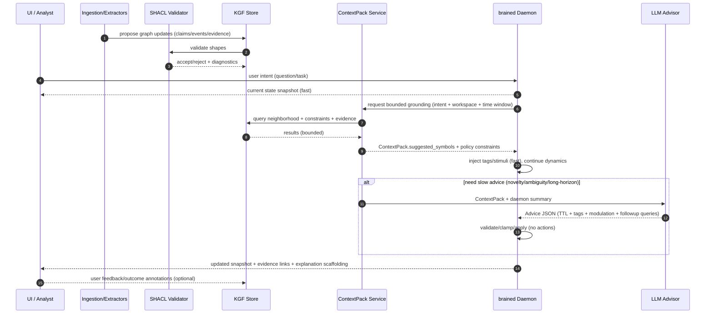

# LLM integration (symbols + modulation) without turning Braine into an LLM

This document describes a **safe, concrete** way to integrate Large Language Models (LLMs) into Braine **as an invoked advisor**, while preserving the project’s non-negotiables:

- The dynamical substrate is the continuous “organism” and stays in control.
- No backprop, no token prediction objective, no gradient training loop.
- The LLM **does not** issue motor commands.
- The LLM can only change **parameters of the vector field** (and/or propose symbols), not the instantaneous state.

The goal is to get the best of both worlds:

- **Fast loop**: oscillator dynamics + local plasticity + scalar reward.
- **Slow loop**: symbolic interpretation + goal/constraint suggestions + safe modulation.

This document is written for a *practical* integration scenario where you may also have:

- an external application (human-in-the-loop UI)
- a retrieval layer (KGF or not)
- a validation/governance layer (e.g. SHACL)

---

## 0) Proposed architecture (components + roles)

Below is a concrete “Braine + LLM + KGF (+ SHACL)” mental model that scales.

### Component roles (clear separation of responsibilities)

- **Braine core (`crates/core`)**
  - Role: always-running dynamical substrate (amp/phase), local learning, meaning/causality memory.
  - Guarantees: fast bounded updates; stable dynamics; learning from scalar feedback; no backprop.
  - Interface: stimuli, neuromodulator, time step, symbol tagging.

- **Daemon (`crates/brained`)**
  - Role: owns long-lived `Brain` state, enforces safety, persistence, and the network protocol.
  - Guarantees: clamps/validates control inputs; applies TTL; auditing; keeps the fast loop alive.
  - Interface: newline-delimited JSON over TCP; “games” today; can be extended to “external env”.

- **LLM service (invoked advisor)**
  - Role: slow-timescale synthesis, interpretation, proposing bounded advice.
  - Guarantees: none (treat as untrusted).
  - Output: strict JSON `Advice` (no direct actions).

- **KGF (Knowledge Graph Fabric)**
  - Role: durable truth layer + provenance + governance; produces bounded `ContextPack`.
  - Guarantees: consistent symbol semantics, lineage, queryability, caching, ACL.

- **SHACL (constraint validation layer)**
  - Role: validates graph updates against schemas (required fields, ranges, controlled vocab).
  - Guarantees: structural integrity of graph data; prevents malformed/unsafe ingestion.
  - Non-goal: it does not select relevance, resolve contradictions, or control behavior.

- **Context Pack service (KGF query + policy)**
  - Role: produces bounded context windows for LLM and Braine; handles caching; enforces budgets.
  - Note: this can exist with or without a full KGF.

- **UI / external systems (humanitarian platform, robotics stack, etc.)**
  - Role: user interaction, task framing, presenting answers, collecting feedback.

### Architecture diagram (proposal)

```mermaid
flowchart LR
  subgraph FastLoop[Fast loop]
    Env[Environment]
    D[brained daemon]
    B[Braine core]
    Env -->|stimuli and reward| D
    D -->|step and commit| B
    B -->|snapshot and metrics| D
  end

  subgraph SlowLoop[Slow loop]
    UI[UI]
    CP[ContextPack service]
    KGF[KGF graph store]
    SHACL[SHACL validation]
    LLM[LLM service]
  end

  UI -->|intent and feedback| CP
  CP -->|read| KGF
  KGF -->|validate writes| SHACL
  SHACL -->|accept/reject| KGF

  D -->|compact daemon summary| CP
  CP -->|ContextPack| LLM
  LLM -->|Advice JSON (TTL tags modulation)| D
  UI <-->|status and requests| D
```

Key safety property:

- The LLM never directly sets `amp/phase` and never issues motor commands.
- The daemon only applies bounded modulations/tags with TTL.

---

## 1) Direct mapping to the current repo architecture

Braine already has the key separation needed for a “slow-fast” architecture.

### Layer A: Dynamical core (always running)

- Core substrate: `Brain` in crates/core/src/core/substrate.rs
- Always-running dynamics:
  - `Brain::step()` updates unit amplitudes/phases.
  - learning + forgetting happen locally (eligibility update + deadband-gated plasticity commit, then `forget_and_prune`).
- Inputs at the boundary (current contract):
  - `Stimulus { name, strength }` (sensor excitation)
  - `neuromodulator` scalar reward/salience via `Brain::set_neuromodulator()`
  - time progression via `step()`

### Layer B: LLM (invoked advisor)

Where it should live in this repo:

- **Best default**: inside the daemon (`crates/brained/`), because the daemon owns the long-lived `Brain` state and already enforces safety constraints.
- Alternative (acceptable): clients (desktop/web) call an LLM and send only **validated** “advice messages” back to the daemon.

This keeps the service boundary clean:

- `brained`: runs the brain and applies validated modulations
- UI clients: observe state, request advice, optionally provide LLM connectivity

---

## 2) What “parameter modulation, not state overwrite” means in code

In Braine, the core state is primarily:

- amplitude `amp` per unit
- phase `phase` per unit

The update rule (scalar path) is explicitly implemented in `Brain::step_dynamics_scalar()`:

- amplitude increment depends on:
  - bias, stimulus input, coupling influence, inhibition, damping, noise
- phase increment depends on:
  - base frequency, coupling phase influence, phase noise

Concretely:

- The LLM must never directly write `units[i].amp` or `units[i].phase`.
- The LLM may propose changes to **configuration parameters** that shape those derivatives:
  - `BrainConfig` fields such as `noise_amp`, `noise_phase`, `global_inhibition`, `hebb_rate`, `forget_rate`, `phase_lock_threshold`, `imprint_rate`, `causal_decay`, etc.

Braine already exposes the safe mechanism for this:

- `Brain::update_config(|cfg| { ... })`
  - Validates the config
  - Forbids topology-bearing changes (`unit_count`, `connectivity_per_unit`) on a live brain

This is exactly the “vector field parameter control” you described.

---

## 3) Safe control surfaces (what an LLM is allowed to change)

Think of these as **actuators** the LLM can influence.

### 3.1 Exploration vs stability (noise / inhibition)

Maps directly to:

- `cfg.noise_amp` (exploration in amplitude)
- `cfg.noise_phase` (exploration in phase)
- `cfg.global_inhibition` (competition/selectivity)

Suggested control pattern:

- LLM outputs a bounded multiplier (e.g. 0.5–2.0)
- daemon applies it for a short TTL (time-to-live) and then decays back to baseline

### 3.2 Plasticity gating (learn / freeze / focus)

Braine already has explicit learning gates:

- `Brain::attention_gate(top_fraction)`
- `Brain::reset_learning_gates()`

This gives a powerful, safe mapping for “this situation matters”:

- “Freeze learning” → temporarily disable learning gates (or force inference-only stepping at the daemon boundary)
- “Focus learning” → `attention_gate(0.05..0.20)`

Note: in daemon games, evaluation mode is already a precedent (SpotXY eval/holdout suppresses learning by discarding observations).

### 3.3 Forgetting / consolidation bias

Maps to:

- `cfg.forget_rate` (structural forgetting)
- `cfg.prune_below` (pruning aggressiveness)
- `cfg.causal_decay` (meaning/causality memory decay)

The LLM should not “edit memories”; it can only bias these rates.

### 3.4 “Phase routing” (what’s feasible today)

Your write-up emphasizes phase bias as the safest routing mechanism.

Today, Braine exposes indirect but still useful phase control:

- `cfg.noise_phase` (randomness in phase evolution)
- `cfg.phase_lock_threshold` (how strict phase alignment must be for Hebbian strengthening)
- `cfg.base_freq` (global oscillator speed)

A practical, incremental approach:

- Phase routing v0: treat “synchronize” as “reduce `noise_phase` + tighten `phase_lock_threshold`”
- Phase routing v1 (recommended future): add a small dedicated “router” sensor group (thalamus analog) whose stimulation patterns bias coupling/phase alignment between groups

That v1 change can be done without giving the LLM direct access to `phase` state: it only produces a stimulus pattern.

---

## 4) Symbol integration (LLM as a symbolizer)

Braine is already explicitly **symbol-boundary first**.

### 4.1 Two kinds of symbols exist today

1) **Sensors** (stimuli) — these inject current and can trigger imprinting

- created via `define_sensor` / `ensure_sensor` / `ensure_sensor_min_width`
- invoked via `apply_stimulus(Stimulus { name, strength })`

2) **Causal/meaning tags** (context symbols) — these are recorded without needing to be sensors

- recorded via `note_symbol(name)`
- recorded compositionally via `note_compound_symbol(&[...])`

This is extremely useful for LLM integration because it gives you a safe “symbolic interface” that doesn’t require the LLM to change dynamics directly.

### 4.2 A recommended contract for LLM-generated symbols

The LLM should not be allowed to invent unbounded new symbol strings.

Implement “symbol governance”:

- canonical prefix for LLM-proposed symbols: `llm::<domain>::...`
- hard limits:
  - max new symbols per minute
  - max symbol length (e.g. 64)
  - allowed character class (`[a-z0-9_:-]`)
- lifecycle:
  - symbols can be proposed as *tags* first (cheap)
  - sensors are only allocated after repeated usefulness or explicit novelty gating

### 4.3 Practical patterns

- LLM interprets raw observation (text, UI event, tool output) → produces:
  - a small set of tags: `note_symbol("llm::intent::explore")`
  - optional compound context keys: `note_compound_symbol(["llm","goal","reach_target"])`
- Daemon may (optionally) map some tags into actual sensor stimuli for stronger coupling to dynamics

---

## 5) When to invoke the LLM (triggers you already have)

You described triggers like “uncertainty high”, “conflict”, “planning horizon exceeded”.

Braine already has closely-related signals in the daemon’s expert system:

- novelty: `novel_context`
- reward regime shift: `reward_shift`
- performance collapse: `performance_collapse`
- saturation: `parent.should_grow(...)`

These are implemented in crates/brained/src/experts.rs.

### Suggested LLM invocation policy

Use an LLM like you use experts: **only when needed**, rate-limited.

- Invoke when any of:
  - novelty/shift/collapse/saturation
  - action ambiguity is high (top-2 action scores close)
  - repeated failure streak crosses threshold
- Never invoke on every frame; treat it as slow-timescale control

A simple ambiguity metric using action scores:

Let top two scores be $s_1 \ge s_2$.

$$
\text{ambiguity} = 1 - \frac{s_1 - s_2}{|s_1| + |s_2| + \epsilon}
$$

Higher ambiguity → more reason to consult the advisor.

---

## 6) A concrete wire protocol for LLM advice (recommended)

Do not let “free-form text” cross the daemon boundary.

Instead: the LLM produces **strict JSON** that the daemon validates.

### 6.1 Input to the LLM (summary, not raw state)

Provide only a compact view:

- current game + step/trial counters
- recent reward history (EMA, streaks)
- top action scores + their gap
- current configuration (or baseline + deltas)
- a short list of recent symbols (stimuli/actions/committed tags)

The daemon already has much of this in `StateSnapshot` and via `InferActionScores`.

### 6.2 Output from the LLM (validated advice)

Example schema (conceptual):

```json
{
  "ttl_steps": 200,
  "confidence": 0.7,
  "symbols": {
    "tags": ["llm::goal::stabilize", "llm::ctx::novel"],
    "compound": [
      ["llm", "constraint", "avoid", "right"],
      ["llm", "plan", "probe", "left"]
    ]
  },
  "modulation": {
    "noise_amp_mul": 1.4,
    "noise_phase_mul": 1.2,
    "hebb_rate_mul": 1.1,
    "forget_rate_mul": 0.9,
    "global_inhibition_mul": 0.95,
    "attention_top_fraction": 0.12,
    "freeze_learning": false
  },
  "notes": "Shift to exploration for 200 steps; tag context as novel."
}
```

Key properties:

- The daemon clamps multipliers and rejects unknown fields.
- TTL is mandatory: advice expires.
- The LLM can suggest symbols; the daemon decides what to accept.

---

## 6.3) Integrating a Knowledge Graph Fabric (KGF) for grounding

In many production “grounded LLM” systems, a Knowledge Graph Fabric (KGF) is the **authoritative
symbol layer**:

- entities, relationships, provenance, timestamps
- constraints/policies and access control
- query + reasoning substrate (graph queries, rules, path constraints)

In a Braine + LLM + KGF architecture, the KGF should be treated as:

- **The long-lived symbolic memory and governance layer**
- **The “contract” for what symbols mean** (names, schemas, provenance)
- **The grounding source** the LLM uses when interpreting text/data

Whereas Braine is:

- the always-running dynamical substrate for fast context, readiness, and local adaptation
- not a database and not a global planner

### Roles (one-sentence mental model)

- **KGF** stores “what is known” (typed symbols + relations + provenance).
- **LLM** proposes “what to do / what to pay attention to” (structured advice).
- **Braine** enacts “how the system behaves moment-to-moment” (dynamics + local learning).

### Why KGF belongs on the *slow* side

Graph queries and LLM calls are usually milliseconds-to-seconds operations and should not be in the
real-time loop. The fast loop should only need:

- bounded stimuli/tags
- bounded config/gating changes with TTL

### What gets written to KGF vs to Braine symbols

Treat KGF as the durable source-of-truth, and Braine symbols as **ephemeral context tokens**.

- Write to **KGF**:
  - entities, events, claims, evidence links, confidence, provenance
  - user goals/constraints (policies), approved definitions of symbols
  - “advice events” (what was proposed, what was applied, what happened)
- Write to **Braine**:
  - short-lived tags representing the *current* context: `llm::intent::*`, `kg::*`, `ui::*`
  - compound keys binding context and action credit assignment: `note_compound_symbol([..])`
  - (optional) a small set of “router” stimuli for attention/phase routing

### A minimal KGF schema for this integration

You do not need a giant ontology to start; you need just enough to ground the LLM and provide
auditable control.

Suggested node types:

- `Entity` (e.g. `Location`, `Org`, `Person`, `Facility`, `Commodity`)
- `Event` (e.g. `Flood`, `MarketShock`, `Outbreak`, `ConvoyDelay`)
- `Claim` (assertion extracted from a report)
- `Evidence` (document span, sensor source, dataset row)
- `Policy` / `Constraint` (what must not be violated)
- `Advice` (LLM proposal) and `Outcome` (measured result)

Suggested edge types:

- `MENTIONS(Entity|Event)`
- `SUPPORTED_BY(Claim -> Evidence)`
- `ABOUT(Claim -> Entity|Event)`
- `CONTRADICTS(Claim <-> Claim)`
- `CONSTRAINS(Policy -> ActionClass|Topic)`
- `PROPOSED(Advice -> (Policy|Symbol|Modulation))`
- `LED_TO(Advice -> Outcome)`

Critical metadata:

- timestamps
- source/provenance (which feed, which user, which extractor)
- access labels / sensitivity
- confidence / uncertainty

### The handshake: how the slow loop becomes a bounded control input

1) Braine/daemon produces a compact summary (fast): action gaps, novelty signals, reward stats.
2) KGF produces a compact context pack (slow): relevant entities/events/constraints with provenance.
3) LLM consumes summary + context pack and emits **strict JSON advice**.
4) Daemon validates advice and applies only bounded modulations/tags with TTL.
5) Outcome is measured and logged back into KGF.

This is a closed loop with auditing, not an “LLM autopilot”.

### Concrete message shapes: `ContextPack` and `Advice`

The key to making this work reliably (and scalably) is to make the interface between
KGF → LLM → daemon **small and typed**.

#### `ContextPack` (KGF → LLM)

This is the bounded “grounding payload” generated by the KGF query layer.
It is intentionally not a whole subgraph dump; it is a *curated context window*.

```json
{
  "pack_id": "kgfpack_2026-01-12T19:00:00Z_district_a_priority_v1",
  "workspace": "org/foo/response-room-3",
  "time_window": { "from": "2026-01-10", "to": "2026-01-12" },
  "intent": "prioritize_72h",
  "constraints": [
    { "id": "policy/no_pii", "text": "Do not reveal personal data." },
    { "id": "policy/cite_sources", "text": "All claims must cite evidence." }
  ],
  "entities": [
    { "id": "loc/district_a", "type": "Location", "label": "District A" },
    { "id": "haz/cholera", "type": "Hazard", "label": "Cholera" },
    { "id": "item/ors", "type": "Commodity", "label": "Oral Rehydration Salts" }
  ],
  "events": [
    {
      "id": "evt/outbreak_123",
      "type": "Outbreak",
      "label": "Suspected cholera outbreak",
      "about": ["loc/district_a", "haz/cholera"],
      "confidence": 0.62,
      "provenance": [
        {
          "evidence_id": "doc/sitrep_778#p3",
          "source": "partner_sitrep",
          "url": "https://…",
          "quote": "…cholera suspected…"
        }
      ]
    }
  ],
  "contradictions": [
    {
      "a": "claim/111",
      "b": "claim/204",
      "text": "Clinic stock level uncertain; conflicting reports."
    }
  ],
  "suggested_symbols": {
    "tags": [
      "kg::loc::district_a",
      "kg::hazard::cholera",
      "kg::item::ors",
      "kg::intent::prioritize_72h"
    ]
  },
  "budget": {
    "max_entities": 30,
    "max_events": 30,
    "max_evidence_chars": 4000
  }
}
```

Notes:

- The KGF layer controls what the LLM sees (and can enforce policy constraints).
- Provenance travels with the pack so the LLM can cite.
- `suggested_symbols.tags` is the bridge into Braine’s symbol boundary.

#### `Advice` (LLM → daemon)

The LLM returns **strict JSON** with bounded modulation and symbol/tag suggestions.
The daemon validates this before applying anything.

```json
{
  "pack_id": "kgfpack_2026-01-12T19:00:00Z_district_a_priority_v1",
  "ttl_steps": 600,
  "confidence": 0.73,
  "symbols": {
    "tags": [
      "llm::goal::reduce_cholera_risk",
      "llm::focus::ors_and_wash",
      "llm::constraint::cite_sources",
      "kg::loc::district_a",
      "kg::hazard::cholera"
    ],
    "compound": [
      ["llm", "plan", "assess", "ors_stock"],
      ["llm", "plan", "verify", "case_definition"],
      ["llm", "plan", "prioritize", "wash_points"]
    ]
  },
  "modulation": {
    "noise_amp_mul": 1.2,
    "noise_phase_mul": 1.1,
    "global_inhibition_mul": 1.05,
    "hebb_rate_mul": 1.05,
    "forget_rate_mul": 0.95,
    "attention_top_fraction": 0.10,
    "freeze_learning": false
  },
  "requested_followups": [
    {
      "type": "kgf_query",
      "query": "clinics in district_a with ors_stockouts and last_update < 7d"
    }
  ]
}
```

Notes:

- `pack_id` lets you audit “what grounding led to what advice”.
- `requested_followups` are not actions; they are *information requests* that stay within the
  KGF governance layer.
- The daemon should clamp multipliers, enforce TTL, and ignore unknown/unsafe fields.

---

## 6.4) Worked example: humanitarian analysis platform (user-interactive)

Assume a platform used by analysts responding to crises. Inputs include:

- situation reports, news, SMS/WhatsApp feeds (text)
- satellite-derived indicators (structured)
- partner data (spreadsheets/APIs)
- interactive user queries (“what’s the risk of cholera in region X?”)

### Components (deployable mental model)

**Hot path (must be fast, scalable):**

- UI/API Gateway
- KGF query service (graph DB + caching)
- Braine daemon (`brained`) per workspace/tenant (or per analyst team)
- Event bus (Kafka/NATS) for ingestion and outcome telemetry

**Slow path (compute-heavy, bursty):**

- LLM service (hosted model or API)
- Extractors (NER/event extraction, linkers) feeding the KGF
- Batch analytics jobs (forecasting, anomaly detection)

### The runtime loop (end-to-end)

#### Step A: ingestion builds the grounded world model (KGF)

1) New report arrives: “Cholera suspected in District A; clinics low on ORS.”
2) Extractor produces structured candidates:
   - `Event: Outbreak(cholera, district_a)`
   - `Claim: clinics_low_ors(district_a)`
   - evidence spans + provenance
3) KGF stores/updates nodes and edges; contradictions are represented, not deleted.

This is the stable grounding substrate.

#### Step B: user asks a question (interactive)

User: “What’s the top priority in District A for the next 72 hours?”

The system should not send the entire KGF to the LLM. Instead:

1) KGF query service returns a **context pack** (bounded):
   - top relevant entities/events
   - constraints/policies (e.g. “do not reveal PII”, “cite provenance”)
   - key evidence snippets/links
2) Braine daemon receives a short set of *context tags*:
   - `kg::topic::outbreak`, `kg::loc::district_a`, `ui::intent::prioritize`
   - plus optionally “urgency” scalar as a stimulus strength

This primes the dynamical core (attention/readiness) without requiring LLM latency.

#### Step C: decide whether to invoke the LLM

Invoke only if needed, e.g.:

- novelty/shift/collapse signals appear
- ambiguity is high (action score gap is small)
- the user asks for long-horizon synthesis

If invoked, the LLM sees:

- a compact daemon summary (what the organism is currently “conflicted” about)
- the KGF context pack (grounding + constraints + provenance)

#### Step D: LLM returns bounded advice (not actions)

Example outcomes from the LLM:

- propose symbols/tags:
  - `llm::goal::reduce_outbreak_risk`
  - `llm::constraint::cite_sources`
  - `llm::focus::w_ash_and_ors`
- propose modulation:
  - increase exploration briefly (to search alternatives)
  - then reduce noise + tighten phase lock (to stabilize a selected plan)
  - gate plasticity (focus learning on the active subgraph)

The daemon applies these with TTL (e.g. 200–1000 steps), and they decay to baseline.

#### Step E: produce an answer + an action recommendation safely

The *user-facing answer* is produced by the application layer (often an LLM-backed response),
but the **system behavior** (what to query next, what to monitor, how to prioritize) is mediated by:

- KGF constraints (what can be said/done)
- Braine’s stabilized context (what is salient/consistent)
- LLM advice (structured, bounded)

Critically: even if the LLM drafts a narrative answer, the platform can enforce:

- “every claim must link to KGF evidence”
- “no action suggestions outside permitted policy set”

#### Step F: feedback closes the loop

After 24–72 hours, outcomes arrive (ground truth updates, analyst feedback).

- KGF stores outcomes
- daemon records reward-like signals (bounded scalar) derived from:
  - correctness of predictions
  - usefulness ratings
  - operational KPIs (false alarms, missed events)

This keeps learning grounded.

---

## 6.5) Performance + scalability considerations

### Keep the fast loop local and bounded

The fast loop must not depend on network LLM latency.

- run `brained` close to the UI or as a lightweight service per tenant
- keep per-step operations O(sparse edges) and bounded
- treat LLM and KGF retrieval as asynchronous inputs that *update parameters/tags*

### Cache the KGF “context pack”

KGF queries can be expensive. Use:

- precomputed neighborhood subgraphs per region/topic
- materialized views for common dashboards
- query result caching keyed by (user, workspace, query intent, time window)

### Use event sourcing for auditability

Persist events:

- what KGF context was shown to LLM
- what advice was returned
- what modulations were applied (and TTL)
- what outcomes followed

This is essential for debugging and governance.

### Multi-tenant scaling pattern

- One shared KGF cluster (sharded/partitioned) with strict ACLs
- Many `brained` instances (cheap) per tenant/workspace (stateful)
- A pooled LLM inference service (stateless, autoscaled)

### Avoid unbounded symbol growth

If the LLM can mint unlimited symbols, the substrate and the KGF will both degrade.

- enforce symbol budgets and review workflows
- prefer mapping to existing ontology nodes
- treat new symbol proposals as candidates requiring confirmation

---

## 6.7) KGF vs SHACL: what SHACL adds (and what it does not)

If you are grounding LLMs with a graph, you often need two distinct things:

1) **A knowledge graph (KGF)**: the data + services + governance around it
2) **A constraint/validation layer**: rules that define what “well-formed” means

SHACL (Shapes Constraint Language) is one popular constraint layer for RDF graphs.

### What KGF provides (architectural)

KGF is the *system architecture* around your knowledge graph:

- storage (graph DB)
- ingestion, entity resolution, provenance
- query APIs, caching
- security/ACLs, auditing
- operational workflows (review, corrections, lineage)

KGF answers: “What does the system believe, and where did it come from?”

### What SHACL provides (validation)

SHACL answers: “Is this graph data structurally valid according to rules?”

Examples of what SHACL-like validation is good at:

- required properties (every `OutbreakEvent` must have a `location`)
- value ranges (confidence in [0,1])
- cardinality constraints (at least one provenance link)
- type constraints (the `location` must be a `Location` node)
- controlled vocab / enums (event types from an allowed set)

This matters for LLM grounding because it reduces garbage-in:

- extractors write claims/events → SHACL validates → only then are they promoted/queried

### What SHACL does *not* solve

Even with perfect SHACL validation:

- It does not resolve contradictions (two valid claims can still conflict)
- It does not select relevance (which 30 nodes matter for this question)
- It does not do temporal control (what should be attended to now)
- It does not provide “continuous” state or stable context under partial cues

In other words: SHACL improves **data quality and safety**, but it does not replace
the need for an online control substrate.

---

## 6.8) Why KGF + LLM alone may fail (and what a dynamical substrate adds)

Many modern systems try to do:

> KGF (facts) + LLM (reasoning) = robust agent

This often works for *static Q&A* but can fail for *interactive, time-extended, uncertain systems*.

### Failure modes of KGF + LLM-only architectures

1) **No continuous state / fragile context**
  - The system re-derives “what matters” each request.
  - Small prompt/context differences can produce different priorities.

2) **Latency and availability coupling**
  - If the LLM is slow, rate-limited, or down, the whole system stalls.
  - If KGF queries are slow, the LLM is starved.

3) **Poor handling of partial cues and noisy inputs**
  - Real-world ops is full of incomplete reports and contradictions.
  - LLMs can oscillate in conclusions without a stabilizing mechanism.

4) **Hard to implement safe “regime control”**
  - Explore vs exploit, freeze vs learn, widen vs narrow attention.
  - LLM-only systems tend to mix these implicitly in the text output.

5) **Over-reliance on explicit symbols**
  - Many important signals are sub-symbolic or pre-attentive (weak indicators).
  - If it isn’t in the context pack, it effectively doesn’t exist.

6) **No built-in adaptation loop**
  - You can log outcomes, but the agent doesn’t have a stable internal substrate
    that adapts online from scalar feedback.

### What the dynamical substrate provides (the missing layer)

Braine adds properties that are hard to get from text-only planning:

1) **Low-latency continuity**
  - It is always running; it maintains readiness/attention without re-prompting.

2) **Stabilization via attractors / hysteresis**
  - Once a context settles, small perturbations don’t flip the conclusion.
  - This is critical for operations where thrashing is expensive.

3) **Safe control knobs with TTL**
  - The LLM can modulate *parameters*, not directly override state.
  - TTL ensures advice expires and the system returns to baseline.

4) **Online adaptation from scalar feedback**
  - The system can incorporate reward signals without storing “answers”.
  - This supports continual learning on the edge (within bounded memory).

5) **Fast, bounded reaction while the slow stack catches up**
  - Even if KGF retrieval or LLM calls are delayed, the substrate can keep
    producing stable behavior and collecting signals.

### The combined system: each layer has a job

- **KGF**: durable truth, provenance, governance, constraints
- **LLM**: synthesis and proposing bounded modulations/symbols under those constraints
- **Braine**: continuous context, stability, and fast regime control

---

## 6.9) End-to-end data flow (humanitarian analysis platform)

This is the concrete “what happens on the wire” story. It’s written to keep the
fast loop independent of LLM/KGF latency.



---

## 11) Repo-aligned tweaks for external continuous & adaptive learning integration

Today, `brained` runs internal “games” that:

- map environment state → stimuli
- choose an action
- score reward
- apply neuromodulator + reinforcement
- commit observation

To integrate with *external systems* (humanitarian platform, robotics controller, ops dashboards),
you typically want an additional mode where the daemon behaves like a **generic closed-loop
learning runtime**, not a self-contained game.

### 11.1 What the core already supports (good news)

`crates/core` already exposes most of the primitives you need:

- **Read-only inference**: `apply_stimulus_inference(...)` + `step_inference()`
- **Safe parameter changes**: `update_config(...)` (validates; blocks topology changes)
- **Learning gates**: `attention_gate(...)`, `reset_learning_gates()`
- **Symbol boundary**: `note_symbol(...)`, `note_compound_symbol(...)`

This means the missing work is primarily at the daemon protocol and runtime boundary.

### 11.2 What `brained` needs to add (recommended minimal surface)

1) **External environment mode**
   - Add a game kind like `external` (or an independent mode) where:
     - stimuli are provided by the client
     - reward is provided by the client (bounded scalar)
     - action selection is still done by the daemon (or optionally “human action”)
   - Keep the same internal order of operations (apply stimuli → step → choose action → note symbols → apply reward → commit).

2) **Protocol endpoints for continuous integration**
   - A minimal set that preserves safety:
     - `ExternalSetStimuli { context_key?, stimuli: [ {name,strength} ] }`
     - `ExternalStep { steps: u32 }` (advances dynamics; optionally returns chosen action)
     - `ExternalSetReward { reward: f32, done?: bool }` (daemon clamps to [-1,1])
     - `ExternalCommit { }` / `ExternalDiscard { }` (mirrors eval/holdout semantics)
     - `NoteSymbols { tags: [String], compound: [[String]] }` (bounded, validated)

3) **Broaden safe config control beyond the current `CfgSet`**
   - Current `CfgSet` controls exploration eps / meaning alpha / timing / max units.
   - For LLM modulation and adaptive learning you’ll likely want a separate, explicit
     request for *safe brain config updates*:
     - `BrainCfgSet { noise_amp?, noise_phase?, global_inhibition?, hebb_rate?, forget_rate?, prune_below?, phase_lock_threshold?, imprint_rate?, causal_decay? }`
   - Implementation should use `Brain::update_config` and enforce clamps/ranges.

4) **Event streaming (optional but important for scale)**
   - Polling `GetState` is fine for a single UI, but for a platform:
     - add a `Subscribe`/stream option for snapshots and/or “trial completed” events
     - keep payloads bounded (deltas or periodic snapshots)

5) **A clean “reward semantics” boundary**
   - For external systems, define a stable contract:
     - reward in [-1,1], plus optional “salience” vs “reward” separation
     - explicit `done`/episode boundary support
   - The daemon can maintain EMA stats and trigger “invoke LLM?” signals.

### 11.3 Why these tweaks matter (benefits you unlock)

- True continuous operation with external data streams (not only built-in games)
- Auditable learning: what stimuli/reward arrived, what symbols were active, what changed
- Stable, low-latency behavior even when retrieval/LLM is slow
- A substrate that can adapt online from scalar feedback in real deployments

---

## 6.6) “Where does Braine help” in a KGF-grounded LLM system?

In a typical KGF-grounded LLM platform, you already have:

- KGF for factual memory
- LLM for synthesis

Braine adds a third thing those systems struggle with:

- a continuously running, low-latency substrate that can maintain *situated context*, handle
  noisy/partial cues, and stabilize behavior under uncertainty without re-prompting an LLM every time.

Practically, Braine becomes the system’s:

- “attention/readiness” engine
- regime controller (explore vs exploit, freeze vs learn)
- local adapter that can respond immediately while the slow stack catches up

---

## 7) Implementation approach (phased, low-risk)

### Phase 0: “LLM in the loop” without code changes

- Use existing endpoints:
  - `GetState`
  - `InferActionScores`
- Human/operator copies summary → LLM → manually applies:
  - `CfgSet` (for exploration/meaning knobs)
  - manual tagging by injecting stimuli/tags in a test harness

This lets you validate the concept before wiring any provider.

### Phase 1: Add an advisor module to the daemon (no auto-apply)

- Add a request like `AdvisorGetPrompt` (returns the compact summary + recommended JSON schema)
- UI can call LLM and then send back `AdvisorProposeAdvice`
- Daemon validates and logs, but does not apply automatically

### Phase 2: Controlled auto-apply

- Daemon accepts `AdvisorApplyAdvice` (validated JSON)
- Daemon applies bounded modulations via:
  - `Brain::update_config`
  - `attention_gate` / `reset_learning_gates`
- Daemon persists an “advice audit log” (for debugging and safety)

### Phase 3: Symbolizer integration for new environments

- Add an explicit “Symbolizer” boundary component:
  - environment → raw observation
  - symbolizer (LLM-assisted) → bounded stimuli/tags
  - daemon → applies stimuli and continues dynamics

This aligns with Braine’s “problem-set contract”: symbols are the interface.

---

## 8) Safety, stability, and failure modes

### Treat the LLM as untrusted

- Parse with strict serde structs
- Clamp and validate all numeric outputs
- Enforce TTL and rate limits
- Keep a hard cap on symbol creation

### Avoid destabilizing parameter jumps

Even if you only change parameters, you can still destabilize the system with step-function changes.

Mitigations:

- apply changes as smooth ramps (lerp to target)
- clamp multipliers to conservative ranges
- apply only for short TTL windows

### Keep reward semantics clean

The LLM should not directly set reward.

- Reward remains grounded in the environment.
- LLM can propose goals/constraints; the environment/game loop still computes reward.

---

## 9) How this matches the “cortex–thalamus–basal ganglia” analogy

Braine already has most of the structure:

- cortex-like substrate: `Brain::step()` recurrent dynamics
- neuromodulation: `set_neuromodulator()` scalar reward signal
- thalamus-like routing (proto): phase/noise/threshold parameters + potential router sensor group
- basal-ganglia-like selection (proto): action selection + meaning prediction
- “advisor” role: LLM produces structured suggestions and modulations

The key is enforcement:

- LLM cannot command actions
- LLM can only bias the substrate’s operating regime

---

## 10) What I would build first (highest ROI)

1) Advisor output as strict JSON + TTL
2) Apply only these actuators initially:
   - `noise_amp` / `noise_phase`
   - `attention_gate(top_fraction)`
   - `hebb_rate` / `forget_rate`
3) Symbol tagging (no new sensors at first):
   - `note_symbol("llm::...")`
   - `note_compound_symbol([...])`
4) Use existing “signals” to trigger advice (novelty/shift/collapse/saturation + ambiguity)

Once that works end-to-end, phase-routing and structured coupling bias can be explored as explicit, bounded mechanisms.
